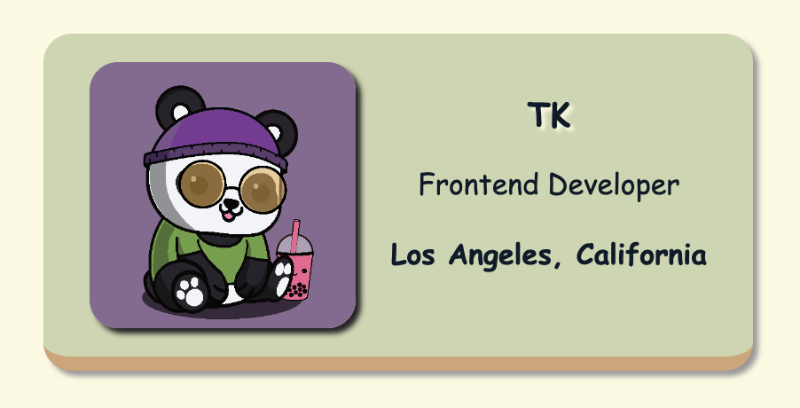

# Personal Digital Business Card

## Overview

This project is a personal digital business card designed as part of a frontend career path challenge from Scrimba. The goal was to implement a visually appealing business card using HTML and CSS, while exploring various web development techniques and tools.



## Live Site

You can view the live version of the business card [here](https://personal-digital-business-card.netlify.app/).

## Features

- **Web Safe Font**: Implemented "Comic Sans MS" to give the card a unique, playful look.
- **Color Palette**: Selected a color palette from Coolors.co to enhance the card's visual appeal.
- **Hover Effects**: Added glowing and bouncing animations on hover to make the card interactive and engaging.
- **Clean and Organized Code**: Ensured the HTML and CSS are well-structured and maintainable.

## Goals

### Basic Goals

- **Web Safe Font**: Find and implement a web safe font.
- **Color Palette**: Select a color palette from Coolors.co and use it in the business card.

### Stretch Goals

- **Personalization**:
  - Shadows
  - Hover effects
  - Animations

## Changes Made

### Initial Version

- Used Verdana, Geneva, Tahoma, sans-serif as the font.
- Basic color palette with light background and dark text.
- Simple static layout.

### Final Version

- **Font**: Changed to "Comic Sans MS" for a unique and playful look.
- **Color Scheme**:
  - Background color of the card: `#ccd5ae`
  - Border-bottom color: `#d4a373`
  - Background color of the body: `#fefae0`
- **Hover Effects**: Added glowing effect on hover for text elements and bounce animation for the avatar.
- **Animations**: Implemented keyframe animations for interactive elements.
- **Image**: Updated to a new image `BearzClub.png`.

## Quick start:

```
$ npm install
$ npm start
```

Head over to https://vitejs.dev/ to learn more about using vite

## About Scrimba

At Scrimba our goal is to create the best possible coding school at the cost of a gym membership! 💜
If we succeed with this, it will give anyone who wants to become a software developer a realistic shot at succeeding, regardless of where they live and the size of their wallets 🎉
The Frontend Developer Career Path aims to teach you everything you need to become a Junior Developer, or you could take a deep-dive with one of our advanced courses 🚀

- [Our courses](https://scrimba.com/allcourses)
- [The Frontend Career Path](https://scrimba.com/learn/frontend)
- [Become a Scrimba Pro member](https://scrimba.com/pricing)

Happy Coding!
